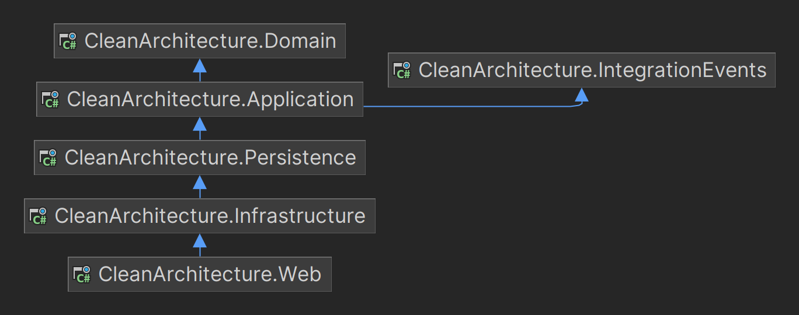

# A Simple Clean Architecture Project

This is an ASP.NET Core Web API template project following clean architecture principles.   
The project is a simple example of an online store.   
You can use it as a base when developing your project.

## Project Structure
Layers of project:
* **CleanArchitecture.Domain** - this layer contains database entities and their specifications.
* **CleanArchitecture.Application** - this layer contains the business logic, handlers and contracts.
    * **CleanArchitecture.IntegrationEvents** - this separate library used for publishing integration events outside the microservice by Bus (RabbitMQ).
* **CleanArchitecture.Persistence** - this layer handles implements the repository interfaces and database operations.
* **CleanArchitecture.Infrastructure** - this layer contains integrations to third-party libraries and services.
* **CleanArchitecture.Web** - this layer is responsible for exposing public Web APIs with whom users or other client applications interact.

In **tests** folder located _UnitTests_, _IntegrationTests_ and _FunctionalTests_ based on XUnit

## Design Patterns
* SOLID
* DDD
* CQRS
* Mediator
* Repository (Read/Write)
* Unit of Work

## Technologies
* [ASP.NET Core 7](https://github.com/dotnet/aspnetcore)
* [EF Core 7](https://github.com/dotnet/efcore)
* [MediatR](https://github.com/jbogard/MediatR)
* [MassTransit](https://github.com/MassTransit/MassTransit)
* [FluentValidation](https://github.com/FluentValidation/FluentValidation)
* [FluentResults](https://github.com/altmann/FluentResults)
* [FluentAssertions](https://github.com/fluentassertions/fluentassertions)
* [TestContainers](https://github.com/testcontainers/testcontainers-dotnet)
* [Bogus](https://github.com/bchavez/Bogus)
* [Serilog](https://github.com/serilog/serilog)
* [HealthChecks](https://github.com/Xabaril/AspNetCore.Diagnostics.HealthChecks)
* [API Versioning](https://github.com/dotnet/aspnet-api-versioning)
* [Docker](https://www.docker.com/):
    * [PostgreSQL](https://www.postgresql.org/)
    * [RabbitMQ](https://www.rabbitmq.com/)

## Getting Started
1. Run `docker-compose up` to start environment: PostgreSQL and RabbitMQ
2. Run `dotnet run --project ./src/CleanArchitecture.Web` from root to start project
3. Open link https://localhost:7235/api/swagger/index.html to show Swagger UI in web browser